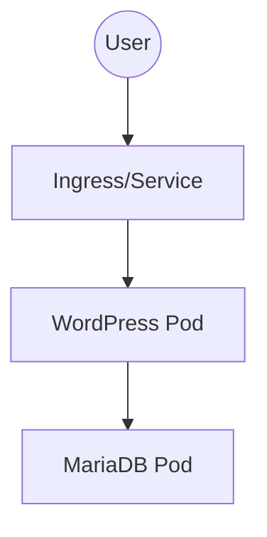

# WordPress Deployment on Kubernetes with Helm

This project demonstrates how to deploy a **WordPress application** with a **MariaDB backend** on Kubernetes using **Helm charts**.  
It is designed as a showcase project for **DevOps & Cloud Engineering portfolios**.  

---

## Project Overview

- **Platform:** Kubernetes (Docker Desktop / Minikube / Kind)  
- **Package Manager:** Helm  
- **App Deployed:** WordPress + MariaDB  
- **Containerised:** Custom Docker image for WordPress  

---

## Architecture



---

## Prerequisites
Docker Desktop with Kubernetes enabled OR Minikube
Helm installed
kubectl installed
GitHub account (for publishing)
Docker Hub account (for custom image)

---

## Deployment Steps
1️⃣ Start Kubernetes Cluster
Docker Desktop (K8s enabled):
```kubectl get nodes```
Or Minikube:
```minikube start```
2️⃣ Add Bitnami Helm Repository
```
helm repo add bitnami https://charts.bitnami.com/bitnami
helm repo update
```
3️⃣ Install WordPress with Helm
```helm install my-wordpress bitnami/wordpress```
4️⃣ Verify Pods and Services
```
kubectl get pods
kubectl get svc
```
5️⃣ Access WordPress
For Minikube:
```minikube service my-wordpress --url```
For Docker Hub :: You need to first port-forward the IP as you cant access the docker hub private IP directly from the laptop's browser
```kubectl port-forward svc/my-wordpress 8080:80```
Open the URL(https://localhost:8080/) in your browser → WordPress is live 🎉


At localhost:8080/wp-admin page
username is user
password generated from the cmd - ```kubectl get secret --namespace default my-wordpress -o jsonpath="{.data.wordpress-password}" | base64 --decode; echo```

---

Live Wordpress Site


Admin page

